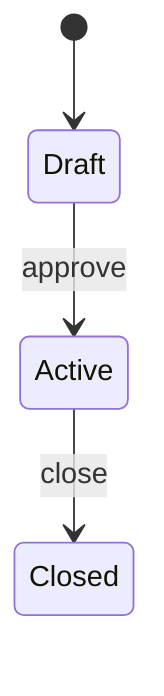

# Spec Markdown Template

Use this template when creating a new file in `docs/spec/`.

## File naming

`NN-TITLE-IN-CAPS.md` where NN is the next available two-digit number (check existing files).

## Template

```markdown
# Title of Specification

> One-sentence context or motivation for this document.

---

## Table of Contents

1. [Overview](#overview)
2. [Section Two](#section-two)
3. [Section Three](#section-three)

---

## Overview

Brief introduction: what this spec covers and why it exists.

---

## Section Two

Content here. Use tables, code blocks, Mermaid diagrams as needed.

### Subsection

More detail.

---

## Section Three

[SCREENSHOT: feature-overview]

Description of what the screenshot shows.

---

## Related Documents

- [Domain Model](01-DOMAIN-MODEL.html)
- [State Machines](02-STATE-MACHINES.html)
```

## Mermaid diagram example (for state machines, flows)

````markdown

````

## Table example

```markdown
| Field | Type | Description |
|---|---|---|
| id | int | Primary key |
| name | string | Display name |
| isActive | bool | Soft delete flag |
```

## Registering in `_convert.py`

After creating the `.md` file, add an entry to the `SPECS` list in `docs/spec/_convert.py`:

```python
SpecDoc(
    md="NN-TITLE-IN-CAPS.md",
    title="Title of Specification",
    subtitle="Brief subtitle shown under the title",
    priority="P1",  # P0 = critical, P1 = important, P2 = nice-to-have
),
```

Add it in the correct numbered position in the list.
